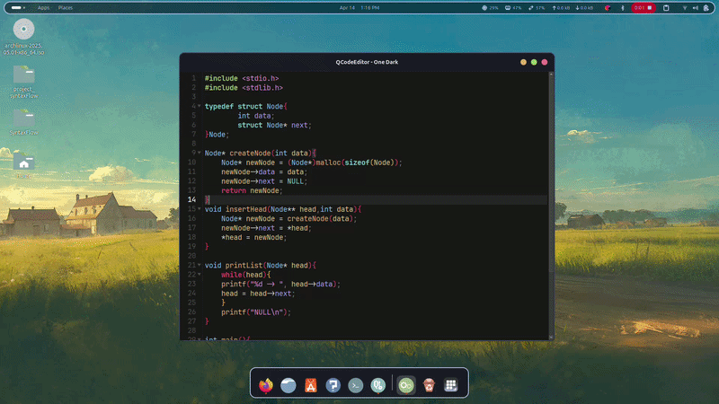

# QCodeEngine-C

QCodeEngine-C is a C programming-oriented editor widget and library built on **Qt 6** (`QPlainTextEdit`) and **Tree-sitter**. It provides a rich set of features tailored for building robust code editors with a strong focus on high-performance syntax highlighting, code folding, and modern editing aids.



## Features

- **Tree-sitter Syntax Highlighting**: Fast and accurate C syntax highlighting using the robust `tree-sitter-c` grammar.
- **Advanced Gutter System**: Multi-panel gutter handling line numbers, fold arrows, and margin markers (bookmarks, breakpoints, etc.).
- **Code Folding**: Context-aware code folding powered by syntax tree traversal.
- **Theme Support**: Built-in themes plus JSON-based theme loading. Use `Ctrl+T` to cycle through available demo themes.
- **Search and Replace**: Integrated find/replace bar with match highlighting and replace workflows.
- **Editor Aids**: Auto-indentation, auto-bracket pairing, customizable keyword autocomplete, bracket guides, and toggleable comments (`Ctrl+/`).
- **Navigation & Overview**: Function list popup (`Ctrl+Shift+O`) and an optional minimap.
- **Diagnostics & Stability**: Syntax error detection, large-document performance modes, and growing regression test coverage.

## Architecture

The project is structured into two main parts:
1. **Application (Demo)**: A lightweight `main.cpp` executable demonstrating the editor widget with theme switching and a sample C document.
2. **QCodeEngine_C Library**: The core library containing the `CodeEditor` (public API) and underlying components:
   - `InnerEditor`: The actual text surface extending `QPlainTextEdit`.
   - `TreeSitterHighlighter`: Handles parsing text via tree-sitter and mapping syntax to styles.
   - `FoldManager`: Computes fold ranges dynamically based on the syntax tree nodes.
   - `GutterWidget`: Composed of modular left-to-right panels (`MarginArea`, `LineNumberArea`, and `FoldArea`).
   - `AutoCompleter`: Provides a custom popup-based completion system tuned for editor-style interaction.
   - `MiniMapWidget`: Renders a compact overview of the current document and viewport.
   - `FindReplaceBar`: Handles incremental search, replace, and match highlighting.

## Build Instructions

**Prerequisites:**
- CMake 3.16 or newer
- Qt 6 (Components: Core, Gui, Widgets)
- C++17 compatible compiler

**Steps to Build:**

```bash
# Clone the repository
git clone https://github.com/Nissmo89/QCodeEngine-C.git
cd QCodeEngine-C

# Create a build directory
mkdir build
cd build

# Configure and compile using CMake
cmake ..
cmake --build .

# Run the demo application
./QCodeEngine-C

# Run the test suite
ctest --output-on-failure
```

## Near-Term Focus

The current work is centered on polishing the editor surface and hardening the library:

- **Interaction Polish**: Continue tightening autocomplete, caret movement, popup dismissal, and keyboard behavior.
- **Layout Polish**: Keep refining typography, line height, spacing, and viewport alignment for better readability.
- **Theme UX**: Improve JSON theme workflows, demo exposure, and theme discovery behavior.
- **Library Hardening**: Expand regression coverage around search/replace, layout, minimap behavior, and editor edge cases.
- **C-aware Intelligence**: Better completion ranking, snippets, and richer symbol-aware editing are the next major feature layer after polish work.
